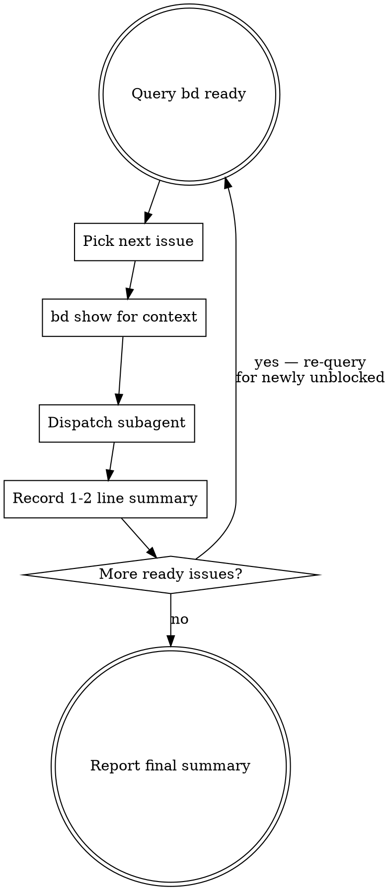

# Beads Agent Dispatch

Execute beads issues with subagents. Sequential by default — one issue per agent, minimal reporting back. Keeps the parent context window small.

**Core principle:** The parent orchestrates via `bd`; subagents do the work. Only essential outcomes flow back.

## The Loop



## Sequential (Default)

- Re-query `bd ready` each iteration — newly unblocked issues surface naturally
- Pass only 1-2 sentence summaries between tasks
- Parent never reads files or explores code inline — if it takes more than a glance, delegate

## Parallel Mode

Use only when explicitly requested or when issues are clearly independent:

1. Each agent **claims** its issue: `bd update <id> --claim` (atomic — prevents double-grab)
2. Dispatch via `superpowers:dispatching-parallel-agents` pattern
3. Each agent closes its own issue when done

## Subagent Prompt Template

```
You are working on beads issue <id>: "<title>"

<full bd show output>

[If relevant: "Previous issue accomplished: <1-2 sentences>"]

Constraints:
- [Scope boundaries]
- [What NOT to change]

When done:
1. Close the issue: `bd close <id> -r "reason"`
2. Do NOT add bead IDs to commit messages — `bd sync` handles this
3. Return ONLY a 1-2 sentence summary of what you did and any key values/paths the next task might need
```

## Common Mistakes

| Mistake | Fix |
|---------|-----|
| Parent reads full subagent output | Ask for "1-2 sentence summary" in every prompt |
| Parent explores code inline | Delegate to subagent |
| Subagent forgets to close issue | Include `bd close` in prompt template |
| Re-query skipped after completion | Always `bd ready` again — deps may have unblocked |
| Parallel without `--claim` | Two agents grab same issue |
