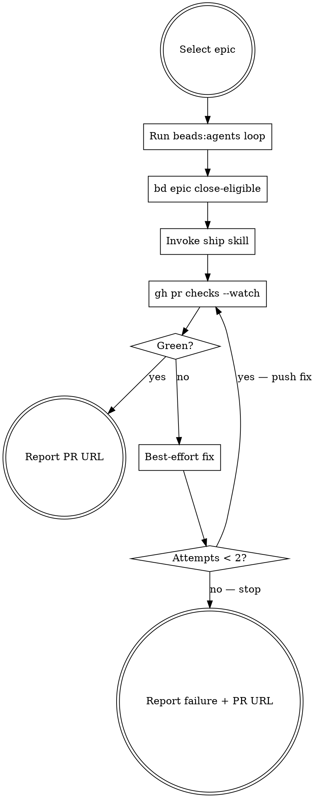

# Next Epic

Work through an epic's tasks via subagents, ship the result, and get CI green.

## Arguments

- **Label:** `beads:next-epic alloy` — first open epic with that label, by priority
- **ID:** `beads:next-epic BD-42` — specific epic
- **None:** highest-priority open epic

## The Flow



## Phase 1: Select Epic

```bash
bd list --type epic --status open   # filter by label/ID from arguments
```

Pick highest priority match. If multiple ambiguous matches, ask the user. Display epic title and task count before proceeding.

## Phase 2: Execute Tasks

**REQUIRED:** Use `beads:agents` skill — sequential mode, one subagent per task, 1-2 sentence summaries between agents. Parent never reads files or explores code.

After the loop completes: `bd epic close-eligible`

## Phase 3: Ship

**REQUIRED:** Invoke the `ship` skill. This commits, pushes, and creates the PR.

## Phase 4: PR Until Green

1. `gh pr checks --watch` to wait for CI
2. If green: report PR URL. Done.
3. If failing:
   - Read logs: `gh pr checks` then `gh run view <run-id> --log-failed`
   - Code issue → fix, commit, push
   - Flaky/infra → push empty commit to re-trigger
   - Loop back to step 1 (max 2 fix attempts)
4. After 2 failed attempts: stop and report failure with PR URL and check details

$ARGUMENTS
