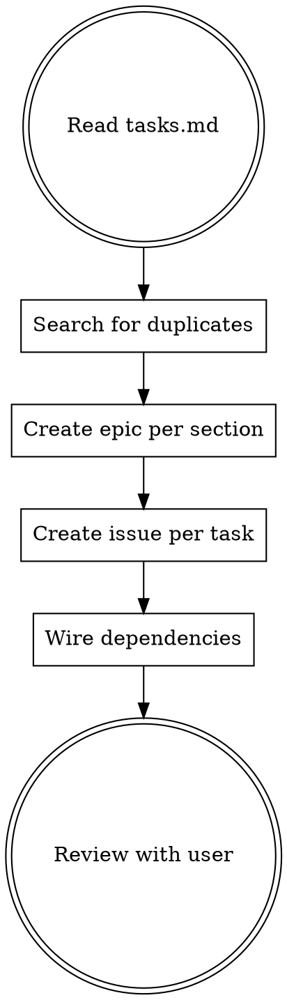

# OpenSpec to Beads

Translate an openspec change into beads issues for execution tracking. Openspec is the planning tool; beads is the execution tracker.

## Pre-checks

1. Verify beads is initialized: `ls .beads/config.yaml`
2. Locate the openspec change: `ls openspec/changes/<name>/`
3. Confirm `tasks.md` exists — this is the primary input

## The Process



### 1. Read the Change

Read these artifacts for context (in order):
- `tasks.md` — the work breakdown (required)
- `proposal.md` — the why and scope
- `specs/` — testable requirements (reference in issue descriptions)
- `design.md` — technical decisions and constraints

### 2. Search for Duplicates

Before creating anything: `bd search "keywords"` for each major task to avoid filing duplicates.

### 3. Create Epics

Each `## N. Section Title` header in `tasks.md` becomes a beads epic. Include a link to the relevant spec file(s) in the description:

```bash
bd create "Section title" -d "Description. Spec: openspec/changes/<name>/specs/<spec-file>" -l "epic,<change-name>"
```

Label every issue with the change name for easy filtering later.

### 4. Create Issues

Each `- [ ]` checkbox item becomes a beads issue linked to its section's epic:

```bash
bd create "Task title" --parent <epic-id> -d "description" -l "<change-name>"
```

**Issue descriptions should include:**
- What to implement (from tasks.md)
- Relevant spec scenarios to satisfy (from specs/)
- Design constraints that apply (from design.md)
- File paths if known

### 5. Wire Dependencies

- Tasks within a section: add `--deps` where ordering matters
- Cross-section dependencies: `bd dep add <issue> <depends-on>`
- Run `bd dep cycles` after wiring to catch mistakes

### 6. Review

Show the user:
- `bd list --tree -l "<change-name>"` — hierarchical view of everything filed
- `bd ready` — what's immediately actionable
- `bd graph --all` — dependency DAG if complex

Iterate up to a few rounds — refine descriptions, adjust dependencies, split or merge issues as needed.

## Guidelines

- **File liberally** — any task over ~2 minutes of work gets its own issue
- **Rich descriptions** — subagents working these issues need full context without reading the openspec
- **Spec traceability** — reference specific requirement/scenario names in issue descriptions so workers can verify against specs
- **Parallelization** — minimize unnecessary dependencies; issues without deps can be worked in parallel via `beads:agents`
