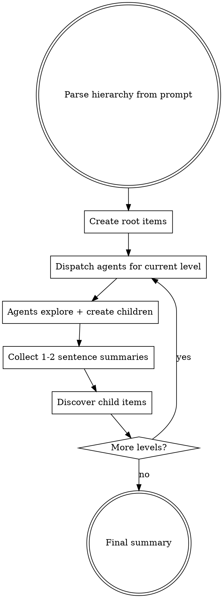

# Deep Tree Exploration

Systematically explore a deep hierarchy by expanding it one level at a time. The orchestrator drives each wave; agents explore nodes and create children for the next wave.

**Key constraint:** Subagents cannot spawn subagents. This skill uses wave-based BFS — the orchestrator dispatches each level.

## When to Use

The user describes a multi-level taxonomy to exhaustively explore:
- "For each class, explore each level, then each ability"
- "Walk this directory tree and analyze each module, then each function"
- "For each API endpoint, document each parameter, then each validation rule"

## The Loop



### Step by Step

1. **Parse the hierarchy** — identify levels from the user's prompt (e.g., class → level → ability = 3 levels)
2. **Create root items** — enumerate top-level nodes using whatever tracking method the user specified
3. **For each level, dispatch agents:**
   - Sequential by default — one agent per node, in order
   - Parallel if user specified — use claim semantics to avoid double-grabs
4. **Each agent:**
   - Receives only its node context + hierarchy spec
   - Explores its node thoroughly
   - Creates child items for the next level
   - Returns 1-2 sentences only
5. **Discover children** — query for newly created items (e.g., `bd ready`, list files in directory)
6. **Repeat** until leaf level
7. **Final summary** — aggregate what was found across the whole tree

## Agent Prompt Template

```
You are exploring "<node name>" at level <N> of a deep hierarchy.

Hierarchy: <full hierarchy spec from user prompt>
Your level: <what this level represents>
Next level: <what children you should create, or "leaf — no children">

Context for this node:
<node-specific context — full text, file contents, etc.>

Your tasks:
1. Explore this node thoroughly
2. Capture findings: <tracking instructions — create beads, write files, etc.>
3. Create child items for the next level: <child creation instructions>
4. Return ONLY a 1-2 sentence summary of what you found and how many children you created
```

**Leaf agents** skip step 3 — they only explore and capture.

## Tracking Options

The skill is agnostic about how findings are recorded. Include tracking instructions in the agent prompt.

| Method | When to use | How children are created |
|--------|------------|------------------------|
| Beads | Multi-session, need dependencies | `bd create --parent <epic-id>` |
| Markdown files | One-shot, human-readable | Files in a directory tree mirroring the hierarchy |
| Summaries only | Quick survey, no artifacts | Agent returns structured text, orchestrator aggregates |

## Parallelism

**Sequential by default.** Dispatch one agent at a time within each level.

To go parallel at a specific level:
- Ensure nodes at that level are truly independent
- Use claim semantics (beads: `bd update <id> --claim`; files: check-before-write)
- Follow `dispatching-parallel-agents` patterns

## Context Discipline

This pattern exists to prevent context blowout. Violating these rules defeats the purpose.

| Rule | Why |
|------|-----|
| Agents return 1-2 sentences only | Parent context stays small |
| Each agent gets only its node context | Agents don't need the whole tree |
| Parent never explores inline | If it takes more than a glance, dispatch an agent |
| Hierarchy spec is passed to every agent | Agents know where they fit without needing tree state |

## Common Mistakes

| Mistake | Fix |
|---------|-----|
| Agent returns full exploration dump | Prompt explicitly says "1-2 sentences only" |
| Orchestrator explores inline | Always delegate to an agent |
| Skipping levels (jumping to leaves) | Follow BFS — each wave expands one level |
| Parallel without claim semantics | Use `--claim` or file locks |
| Inconsistent child naming | Include naming conventions in agent prompt |
| Passing parent findings to child agents | Children get their own node context, not parent's findings |
